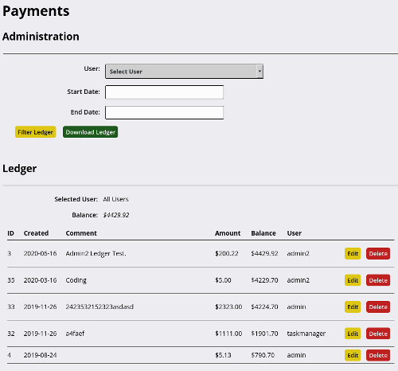

 

{: .screenshot}

# Payments module
{:.no_toc}

* TOC
{:toc}

Add eCommerce functionality, providing monetary incentive for users to complete assigned media creation and management tasks.

Payments can be set for; task complettion, updating media, creating and updating their assigned play list, more....

Filter by `User`, `Date` and `Activity`

Includes a General Ledger to add transactions and download history

Add notes to payments

Integrates with [Task Tracker](https://github.com/openbroadcaster/task-tracker/) module

